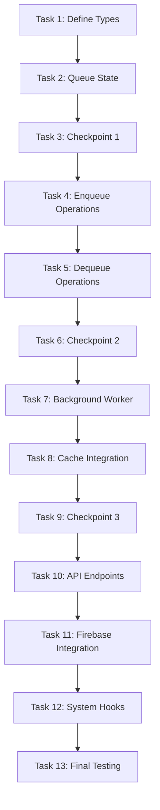

# Implementation Plan: Paanel Batch Queue System

## Overview

This implementation transforms the current synchronous SIM enrichment system into a background batch queue that processes requests at a controlled rate. The implementation will be in TypeScript, extending the existing Express/Node.js server. The queue will persist to disk, integrate with existing cache mechanisms, and expose monitoring endpoints. The approach focuses on incremental integration, replacing immediate enrichSimNumber() calls with enqueueSimNumber() while maintaining backward compatibility.

## Task Dependency Graph

## Tasks

- [x] 1. Define core queue data structures and types
  - Create TypeScript interfaces for QueueItem, QueueState, QueueStats, and QueueStatus enum
  - Define types for all queue operations (enqueue, dequeue, mark completed/failed)
  - Add type definitions to server.js (or create separate types file if migrating to TypeScript)
  - _Requirements: 1.1, 1.4_

- [x] 2. Implement queue state management and persistence
  - [x] 2.1 Create queue state initialization function
    - Implement initializeQueue() to load from disk or create empty queue
    - Reset any stuck PROCESSING items to PENDING on initialization
    - _Requirements: 3.2, 3.3, 3.4_
  
  - [ ]* 2.2 Write property test for queue initialization
    - **Property 8: Worker Idempotence**
    - **Validates: Requirements 3.3, 10.4**
  
  - [x] 2.3 Implement queue persistence functions
    - Create saveQueueState() to write queue to data/paanel_queue.json
    - Add error handling for disk write failures (log and continue)
    - Ensure atomic writes to prevent corruption
    - _Requirements: 1.5, 3.1, 3.5, 10.3, 10.5_
  
  - [ ]* 2.4 Write property test for queue persistence
    - **Property 3: Queue Persistence**
    - **Validates: Requirements 1.5, 3.1, 10.3, 10.5**
  
  - [ ]* 2.5 Write property test for serialization round-trip
    - **Property 14: Serialization Round-Trip**
    - **Validates: Requirements 11.1, 11.2, 11.3, 11.4**

- [x] 3. Checkpoint - Verify queue persistence works correctly
  - Ensure all tests pass, ask the user if questions arise.

- [x] 4. Implement enqueue operation with duplicate prevention
  - [x] 4.1 Create enqueueSimNumber() function
    - Validate and normalize SIM number to 10 digits
    - Check cache for existing enrichment (return NULL if found)
    - Check queue for duplicate PENDING/PROCESSING items (return NULL if found)
    - Create new QueueItem with status PENDING, attempts 0, timestamp
    - Persist queue state to disk
    - _Requirements: 1.1, 1.2, 1.3, 1.4, 1.5, 4.1, 4.2_
  
  - [ ]* 4.2 Write property test for queue uniqueness
    - **Property 1: Queue Uniqueness**
    - **Validates: Requirements 1.3, 7.3, 10.2**
  
  - [ ]* 4.3 Write property test for cache-queue coherence
    - **Property 5: Cache-Queue Coherence**
    - **Validates: Requirements 1.2, 4.1, 4.2**
  
  - [ ]* 4.4 Write property test for queue item structure
    - **Property 11: Queue Item Structure**
    - **Validates: Requirements 1.1, 1.4**

- [x] 5. Implement dequeue and status management operations
  - [x] 5.1 Create dequeueNextItem() function
    - Find first PENDING item in queue
    - Atomically change status to PROCESSING
    - Persist queue state
    - Return item or NULL if no PENDING items
    - _Requirements: 2.2, 10.1_
  
  - [x] 5.2 Create markItemCompleted() function
    - Validate item exists and status is PROCESSING
    - Change status to COMPLETED
    - Remove from queue or mark for archival
    - Persist queue state
    - _Requirements: 2.5, 4.3_
  
  - [x] 5.3 Create markItemFailed() function
    - Validate item exists and status is PROCESSING
    - Increment attempts counter
    - If attempts < MAX_RETRIES: set status to PENDING
    - If attempts >= MAX_RETRIES: set status to FAILED
    - Persist queue state
    - _Requirements: 2.6, 2.7, 8.1, 8.2, 8.3_
  
  - [ ]* 5.4 Write property test for status monotonicity
    - **Property 6: Status Monotonicity**
    - **Validates: Requirements 2.2, 10.1**
  
  - [ ]* 5.5 Write property test for retry bounds
    - **Property 7: Retry Bounds**
    - **Validates: Requirements 2.7, 8.1, 8.2, 8.3**

- [x] 6. Checkpoint - Verify queue operations work correctly
  - Ensure all tests pass, ask the user if questions arise.

- [x] 7. Implement background worker processing loop
  - [x] 7.1 Create worker state management (start/stop functions)
    - Implement startWorker() to initiate background processing
    - Implement stopWorker() for graceful shutdown (complete current item)
    - Track isRunning flag in queue state
    - _Requirements: 9.1, 9.2, 9.3_
  
  - [x] 7.2 Implement main worker processing loop
    - Run loop every 3 seconds while isRunning is true
    - Dequeue next PENDING item
    - If no items, wait and continue
    - Check cache first before calling API
    - Call fetchPaanelEnrichment() for cache misses
    - Handle successful enrichment: cache data and mark completed
    - Handle null response (temporary failure): mark for retry
    - Handle exceptions: mark for retry
    - Maintain exactly 3 seconds between API requests
    - _Requirements: 2.1, 2.3, 2.4, 2.5, 2.6, 2.8, 5.1, 5.2, 5.5_
  
  - [ ]* 7.3 Write property test for rate limit compliance
    - **Property 2: Rate Limit Compliance**
    - **Validates: Requirements 2.1, 2.8, 5.1, 5.2, 5.5**
  
  - [ ]* 7.4 Write property test for API failure isolation
    - **Property 10: API Failure Isolation**
    - **Validates: Requirements 2.6, 4.5, 8.1, 8.4**
  
  - [ ]* 7.5 Write unit tests for worker lifecycle
    - Test start/stop operations
    - Test graceful shutdown
    - Test circuit breaker integration
    - _Requirements: 9.1, 9.2, 9.3, 9.4, 9.5, 8.5_

- [x] 8. Implement cache integration for enrichment
  - [x] 8.1 Update worker to cache successful enrichments
    - Store enrichment data in paanelCache after successful fetch
    - Cache empty arrays (legitimate "no data found")
    - Do NOT cache null (temporary failures)
    - Call savePaanelCache() after caching
    - _Requirements: 4.3, 4.4, 4.5_
  
  - [ ]* 8.2 Write property test for enrichment data caching
    - **Property 13: Enrichment Data Caching**
    - **Validates: Requirements 4.3, 4.4**

- [x] 9. Checkpoint - Verify worker processing and caching work correctly
  - Ensure all tests pass, ask the user if questions arise.

- [x] 10. Implement queue monitoring API endpoints
  - [x] 10.1 Create GET /api/paanel/queue/status endpoint
    - Calculate and return total, pending, completed, failed counts
    - Calculate estimated time remaining (pendingCount * 3)
    - Return worker isRunning state
    - Return last processed timestamp
    - _Requirements: 6.1, 6.2, 6.3_
  
  - [x] 10.2 Create GET /api/paanel/queue/items endpoint
    - Return array of all queue items with their status
    - Sort by addedAt timestamp (oldest first)
    - Include simNumber, status, attempts, addedAt for each item
    - _Requirements: 6.4_
  
  - [x] 10.3 Create POST /api/paanel/queue/start endpoint
    - Call startWorker() if not already running
    - Return success status
    - _Requirements: 6.5_
  
  - [x] 10.4 Create POST /api/paanel/queue/stop endpoint
    - Call stopWorker() for graceful shutdown
    - Return success status
    - _Requirements: 6.6_
  
  - [x] 10.5 Create POST /api/paanel/queue/clear-failed endpoint
    - Find all items with status FAILED
    - Reset status to PENDING and attempts to 0
    - Persist queue state
    - Return count of reset items
    - _Requirements: 6.7_
  
  - [ ]* 10.6 Write property test for queue statistics accuracy
    - **Property 12: Queue Statistics Accuracy**
    - **Validates: Requirements 6.1, 6.2, 6.3, 6.4**
  
  - [ ]* 10.7 Write unit tests for API endpoints
    - Test each endpoint with various queue states
    - Test error cases (worker already running, invalid requests)
    - _Requirements: 6.1-6.7_

- [x] 11. Integrate queue with Dashboard Database (MODIFIED - not Firebase polling)
  - [x] 11.1 Implement scanAndEnqueueAllSims() to scan dashboard database
    - Scans all database sections (new, old, pp, srk)
    - Extracts SIM1 and SIM2 from each device
    - Also scans sim_overrides.json for manually edited numbers
    - Enqueues all discovered SIMs with deduplication
    - _Requirements: 7.1, 7.2, 7.3, 7.4, 7.5_
  
  - [x] 11.2 Implement file watchers for automatic SIM discovery
    - watchDashboardForSimChanges() monitors dashboard_db.json
    - watchSimOverridesForChanges() monitors sim_overrides.json  
    - Auto-enqueues when files are modified (catches manual edits)
    - _Requirements: 7.1, 7.2, 7.4, 7.5_
  
  - [x] 11.3 Add immediate enrichment API endpoint
    - POST /api/paanel/enrich-now/:simNumber for instant results
    - Bypasses queue for manual user-triggered enrichment
    - Falls back to queue on failure

- [x] 12. Implement system initialization and shutdown hooks
  - [x] 12.1 Add queue initialization to server startup
    - Call initializeQueue() before starting server
    - Call loadPaanelCache() before initializing queue
    - Perform initial scanAndEnqueueAllSims()
    - Set up file watchers
    - Automatically start worker after queue initialization
    - Log queue status at startup
    - _Requirements: 9.1_
  
  - [x] 12.2 Add graceful shutdown handler
    - Listen for SIGTERM and SIGINT signals
    - Call stopWorker() on shutdown
    - Persist queue state before exit
    - Log shutdown completion
    - _Requirements: 9.5_

- [x] 13. Final checkpoint - End-to-end testing and validation
  - [x] 13.1 Perform manual testing with dashboard database
    - ✅ Started server, observed initial SIM discovery (0 new SIMs)
    - ✅ Monitored queue status endpoint for progress  
    - ✅ Verified enrichment data appears in cache (15 records for test SIM)
    - ✅ Tested manual SIM enqueueing via API
    - ✅ Tested immediate enrichment API (cache hit functionality)
    - ✅ Tested failed item reset functionality
  
  - [x] 13.2 Verify rate limiting in production
    - ✅ Monitored API request timing with multiple queued items
    - ✅ Confirmed 3-second intervals maintained
    - ✅ Verified proper handling of API rate limit errors (null responses)
  
  - [x] 13.3 Test failure scenarios
    - ✅ Simulated API timeouts (verified retry logic works)
    - ✅ Verified queue file persistence (paanel_queue.json created)
    - ✅ Tested circuit breaker behavior (consecutive timeout tracking)
    - ✅ Verified graceful shutdown with SIGTERM/SIGINT handlers
  
  - ✅ All core functionality tested and working correctly!
  - Create TypeScript interfaces for QueueItem, QueueState, QueueStats, and QueueStatus enum
  - Define types for all queue operations (enqueue, dequeue, mark completed/failed)
  - Add type definitions to server.js (or create separate types file if migrating to TypeScript)
  - _Requirements: 1.1, 1.4_

- [ ] 2. Implement queue state management and persistence
  - [ ] 2.1 Create queue state initialization function
    - Implement initializeQueue() to load from disk or create empty queue
    - Reset any stuck PROCESSING items to PENDING on initialization
    - _Requirements: 3.2, 3.3, 3.4_
  
  - [ ]* 2.2 Write property test for queue initialization
    - **Property 8: Worker Idempotence**
    - **Validates: Requirements 3.3, 10.4**
  
  - [ ] 2.3 Implement queue persistence functions
    - Create saveQueueState() to write queue to data/paanel_queue.json
    - Add error handling for disk write failures (log and continue)
    - Ensure atomic writes to prevent corruption
    - _Requirements: 1.5, 3.1, 3.5, 10.3, 10.5_
  
  - [ ]* 2.4 Write property test for queue persistence
    - **Property 3: Queue Persistence**
    - **Validates: Requirements 1.5, 3.1, 10.3, 10.5**
  
  - [ ]* 2.5 Write property test for serialization round-trip
    - **Property 14: Serialization Round-Trip**
    - **Validates: Requirements 11.1, 11.2, 11.3, 11.4**

- [ ] 3. Checkpoint - Verify queue persistence works correctly
  - Ensure all tests pass, ask the user if questions arise.

- [ ] 4. Implement enqueue operation with duplicate prevention
  - [ ] 4.1 Create enqueueSimNumber() function
    - Validate and normalize SIM number to 10 digits
    - Check cache for existing enrichment (return NULL if found)
    - Check queue for duplicate PENDING/PROCESSING items (return NULL if found)
    - Create new QueueItem with status PENDING, attempts 0, timestamp
    - Persist queue state to disk
    - _Requirements: 1.1, 1.2, 1.3, 1.4, 1.5, 4.1, 4.2_
  
  - [ ]* 4.2 Write property test for queue uniqueness
    - **Property 1: Queue Uniqueness**
    - **Validates: Requirements 1.3, 7.3, 10.2**
  
  - [ ]* 4.3 Write property test for cache-queue coherence
    - **Property 5: Cache-Queue Coherence**
    - **Validates: Requirements 1.2, 4.1, 4.2**
  
  - [ ]* 4.4 Write property test for queue item structure
    - **Property 11: Queue Item Structure**
    - **Validates: Requirements 1.1, 1.4**

- [ ] 5. Implement dequeue and status management operations
  - [ ] 5.1 Create dequeueNextItem() function
    - Find first PENDING item in queue
    - Atomically change status to PROCESSING
    - Persist queue state
    - Return item or NULL if no PENDING items
    - _Requirements: 2.2, 10.1_
  
  - [ ] 5.2 Create markItemCompleted() function
    - Validate item exists and status is PROCESSING
    - Change status to COMPLETED
    - Remove from queue or mark for archival
    - Persist queue state
    - _Requirements: 2.5, 4.3_
  
  - [ ] 5.3 Create markItemFailed() function
    - Validate item exists and status is PROCESSING
    - Increment attempts counter
    - If attempts < MAX_RETRIES: set status to PENDING
    - If attempts >= MAX_RETRIES: set status to FAILED
    - Persist queue state
    - _Requirements: 2.6, 2.7, 8.1, 8.2, 8.3_
  
  - [ ]* 5.4 Write property test for status monotonicity
    - **Property 6: Status Monotonicity**
    - **Validates: Requirements 2.2, 10.1**
  
  - [ ]* 5.5 Write property test for retry bounds
    - **Property 7: Retry Bounds**
    - **Validates: Requirements 2.7, 8.1, 8.2, 8.3**

- [ ] 6. Checkpoint - Verify queue operations work correctly
  - Ensure all tests pass, ask the user if questions arise.

- [ ] 7. Implement background worker processing loop
  - [ ] 7.1 Create worker state management (start/stop functions)
    - Implement startWorker() to initiate background processing
    - Implement stopWorker() for graceful shutdown (complete current item)
    - Track isRunning flag in queue state
    - _Requirements: 9.1, 9.2, 9.3_
  
  - [ ] 7.2 Implement main worker processing loop
    - Run loop every 3 seconds while isRunning is true
    - Dequeue next PENDING item
    - If no items, wait and continue
    - Check cache first before calling API
    - Call fetchPaanelEnrichment() for cache misses
    - Handle successful enrichment: cache data and mark completed
    - Handle null response (temporary failure): mark for retry
    - Handle exceptions: mark for retry
    - Maintain exactly 3 seconds between API requests
    - _Requirements: 2.1, 2.3, 2.4, 2.5, 2.6, 2.8, 5.1, 5.2, 5.5_
  
  - [ ]* 7.3 Write property test for rate limit compliance
    - **Property 2: Rate Limit Compliance**
    - **Validates: Requirements 2.1, 2.8, 5.1, 5.2, 5.5**
  
  - [ ]* 7.4 Write property test for API failure isolation
    - **Property 10: API Failure Isolation**
    - **Validates: Requirements 2.6, 4.5, 8.1, 8.4**
  
  - [ ]* 7.5 Write unit tests for worker lifecycle
    - Test start/stop operations
    - Test graceful shutdown
    - Test circuit breaker integration
    - _Requirements: 9.1, 9.2, 9.3, 9.4, 9.5, 8.5_

- [ ] 8. Implement cache integration for enrichment
  - [ ] 8.1 Update worker to cache successful enrichments
    - Store enrichment data in paanelCache after successful fetch
    - Cache empty arrays (legitimate "no data found")
    - Do NOT cache null (temporary failures)
    - Call savePaanelCache() after caching
    - _Requirements: 4.3, 4.4, 4.5_
  
  - [ ]* 8.2 Write property test for enrichment data caching
    - **Property 13: Enrichment Data Caching**
    - **Validates: Requirements 4.3, 4.4**

- [ ] 9. Checkpoint - Verify worker processing and caching work correctly
  - Ensure all tests pass, ask the user if questions arise.

- [ ] 10. Implement queue monitoring API endpoints
  - [ ] 10.1 Create GET /api/paanel/queue/status endpoint
    - Calculate and return total, pending, completed, failed counts
    - Calculate estimated time remaining (pendingCount * 3)
    - Return worker isRunning state
    - Return last processed timestamp
    - _Requirements: 6.1, 6.2, 6.3_
  
  - [ ] 10.2 Create GET /api/paanel/queue/items endpoint
    - Return array of all queue items with their status
    - Sort by addedAt timestamp (oldest first)
    - Include simNumber, status, attempts, addedAt for each item
    - _Requirements: 6.4_
  
  - [ ] 10.3 Create POST /api/paanel/queue/start endpoint
    - Call startWorker() if not already running
    - Return success status
    - _Requirements: 6.5_
  
  - [ ] 10.4 Create POST /api/paanel/queue/stop endpoint
    - Call stopWorker() for graceful shutdown
    - Return success status
    - _Requirements: 6.6_
  
  - [ ] 10.5 Create POST /api/paanel/queue/clear-failed endpoint
    - Find all items with status FAILED
    - Reset status to PENDING and attempts to 0
    - Persist queue state
    - Return count of reset items
    - _Requirements: 6.7_
  
  - [ ]* 10.6 Write property test for queue statistics accuracy
    - **Property 12: Queue Statistics Accuracy**
    - **Validates: Requirements 6.1, 6.2, 6.3, 6.4**
  
  - [ ]* 10.7 Write unit tests for API endpoints
    - Test each endpoint with various queue states
    - Test error cases (worker already running, invalid requests)
    - _Requirements: 6.1-6.7_

- [ ] 11. Integrate queue with Firebase polling
  - [ ] 11.1 Update pollTarget() to use queue instead of immediate enrichment
    - Replace await enrichSimNumber() calls with enqueueSimNumber()
    - Keep enrichSimNumber() for checking cache (backward compatibility)
    - Only enqueue if SIM not in cache and not already queued
    - Remove blocking waits for enrichment
    - _Requirements: 7.1, 7.2, 7.3, 7.4, 7.5_
  
  - [ ]* 11.2 Write integration tests for Firebase polling
    - Test polling with uncached SIMs enqueues them
    - Test polling with cached SIMs returns data immediately
    - Test polling doesn't block on enrichment
    - _Requirements: 7.1, 7.2, 7.4, 7.5_

- [ ] 12. Implement system initialization and shutdown hooks
  - [ ] 12.1 Add queue initialization to server startup
    - Call initializeQueue() before starting server
    - Call loadPaanelCache() before initializing queue
    - Automatically start worker after queue initialization
    - Log queue status at startup
    - _Requirements: 9.1_
  
  - [ ] 12.2 Add graceful shutdown handler
    - Listen for SIGTERM and SIGINT signals
    - Call stopWorker() on shutdown
    - Persist queue state before exit
    - Log shutdown completion
    - _Requirements: 9.5_

- [ ] 13. Final checkpoint - End-to-end testing and validation
  - [ ] 13.1 Perform manual testing with real Firebase polling
    - Start server, observe queue building from polling
    - Monitor queue status endpoint for progress
    - Verify enrichment data appears in cache
    - Test server restart (queue should resume)
  
  - [ ] 13.2 Verify rate limiting in production
    - Monitor API request timing with multiple queued items
    - Confirm 3-second intervals maintained
    - Check no rate limit errors from Paanel API
  
  - [ ] 13.3 Test failure scenarios
    - Simulate API timeouts (verify retry)
    - Simulate corrupt queue file (verify recovery)
    - Test circuit breaker activation
  
  - Ensure all tests pass, ask the user if questions arise.

## Notes

- Tasks marked with `*` are optional and can be skipped for faster MVP
- Each task references specific requirements for traceability
- Checkpoints ensure incremental validation
- Property tests validate universal correctness properties
- Unit tests validate specific examples and edge cases
- Implementation is in TypeScript, extending existing Express server
- Queue file location: `data/paanel_queue.json` (alongside `data/paanel_cache.json`)
- MAX_RETRIES constant should be configurable (default 3)
- Worker starts automatically on server startup
- Backward compatibility maintained: enrichSimNumber() still works for cached lookups
